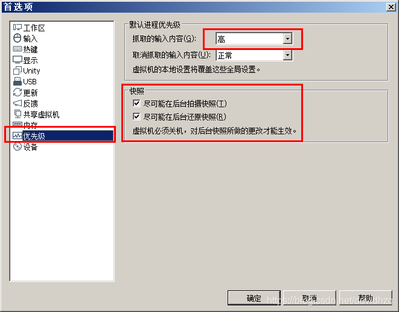
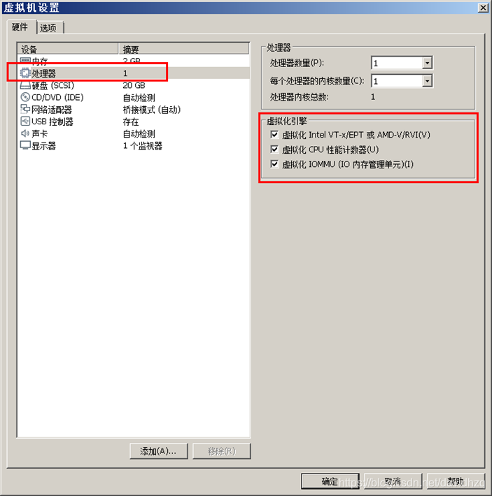
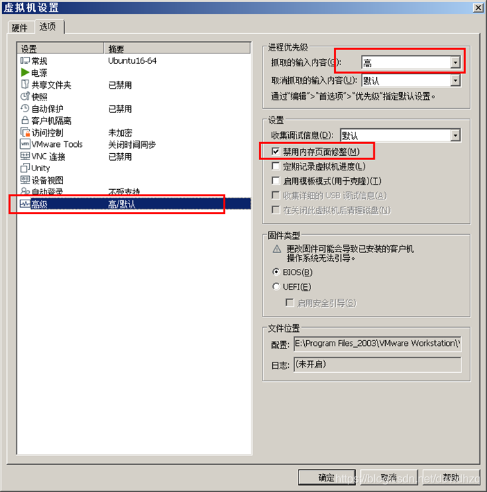

# 加快 VMware 运行速度

## 1. VMware相关设置

### 1.1 提高运行优先级

- 优先级  
  
- 提高 VMware 运行优先级  
  

### 1.2 禁止交换内存

- 内存交换会显著降低运行速度  
  

### 1.3 禁止组件更新

- 勾选掉如下项目  
  

### 1.4 禁止反馈

- 不加入客户体验提升计划  
  

## 2. 客户机相关设置

### 2.1 虚拟引擎

- 在  BIOS 打开 `Intel虚拟技术` 的选项；
- 客户机配置的硬件如下设置：  
  

### 2.2 设置内存

- 当然，必须有足够的 物理内存，才能保证虚拟机可以设置更大的内存。
- 禁用内存页面修改  
  

### 2.3 显示器

- 设置 3D加速  
  

### 2.4 删除无需虚拟硬件

- 虚拟机的软盘和打印机等，一般没有需要  
  
- 禁止 CD-ROM 的启动连接  
  
- 设置 USB 控制器  
  
- 设置 声卡  
  

### 2.5 安装 VMwareTool

- 虚拟机安装结束之后，不要忘记安装 VmwareTool，另外也需要设置更新选项  
  

## 3. 客户机维护

### 3.1 磁盘碎片整理

- 长期不整理硬盘随便，会显著降低 IO存取 速度  
  